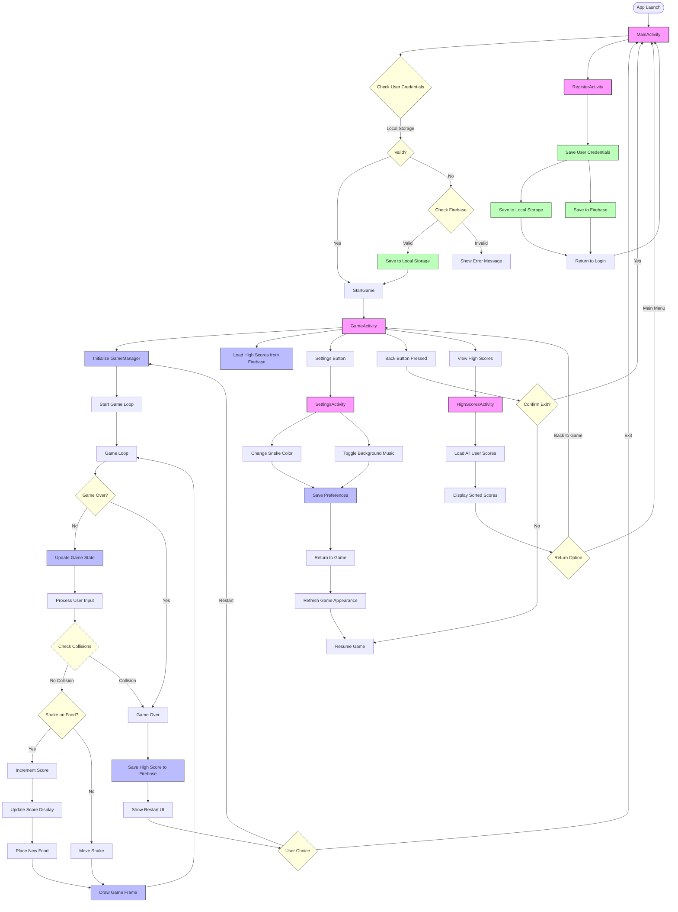

# Snake Game Application Flow

## Detailed Flow Description

### Authentication Flow
1. **App Launch**: The application starts with MainActivity
2. **Login Check**: User credentials are checked first in local storage
3. **Fallback Authentication**: If not in local storage, Firebase is checked
4. **Registration**: New users can register, saving data to both local storage and Firebase

### Game Initialization
1. **Start Game**: After authentication, GameActivity is launched
2. **Initialize**: GameManager initializes the game state (snake position, food, score)
3. **Load High Scores**: Personal and global high scores are loaded from Firebase

### Main Game Loop
1. **Game Loop**: Runs on a separate thread with fixed timing
2. **Update Game State**: 
   - Process user input (direction changes)
   - Check for collisions (walls/self)
   - Handle food consumption
   - Move snake
3. **Render**: Draw the updated game state on screen

### Game Over Flow
1. **Collision Detection**: Game ends when snake hits a wall or itself
2. **Save High Score**: If score is a new personal best, update Firebase
3. **User Options**: Player can restart the game or return to the main menu

### Settings and Customization
1. **Settings Screen**: Accessed from GameActivity
2. **Customization Options**: 
   - Snake color selection
   - Background music toggle
3. **Return Flow**: Settings are saved and immediately applied when returning to the game

### Navigation Handling
1. **Back Button**: Confirmation dialog prevents accidental exits
2. **Activity Transitions**: Managed to preserve state between screens
3. **Intent Handling**: Username and other data passed between activities

### High Score Tracking
1. **Personal Best**: Tracked and displayed during gameplay
2. **Global High Score**: Retrieved from Firebase to show top score
3. **High Scores Screen**: Displays leaderboard with all user scores 